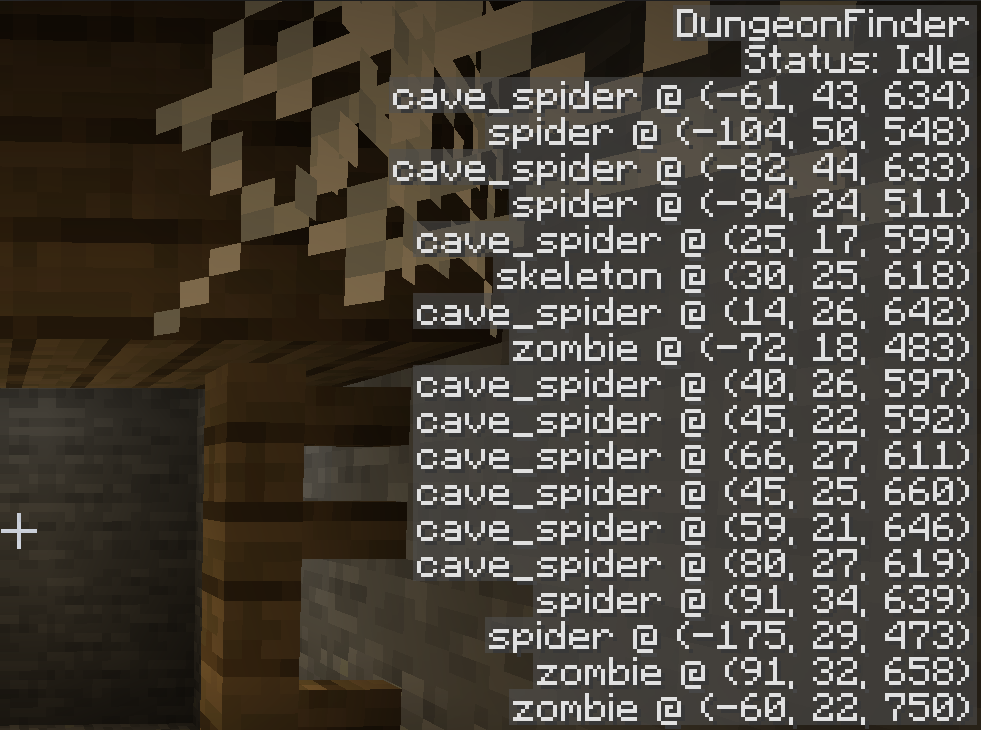

# DungeonFinder

> **Note:** This mod is a work in progress!

DungeonFinder is a mod for Minecraft 1.14.4 that locates and displays the coordinates of nearby dungeons.

For efficiency, this is acheived by simply locating all nearby Mob Spawners.

The algorithm used is extremely quick, capable of scanning all rendered chunks (determined by the render distance) almost instantaneously.

## Usage

For now, the mod just displays its status and search results as text at the top-right corner of the HUD.

## Default Hotkeys

* `[ (Left Bracket) = Restart Search`
* `] (Right Bracket) = Show/Hide Text`
* `\ (Backslash) = Start, Pause/Resume Search`

## Planned Features

* Filtering of search results (e.g., by spawner entity)
* Searching beyond the render distance
* Visual customization of search results
